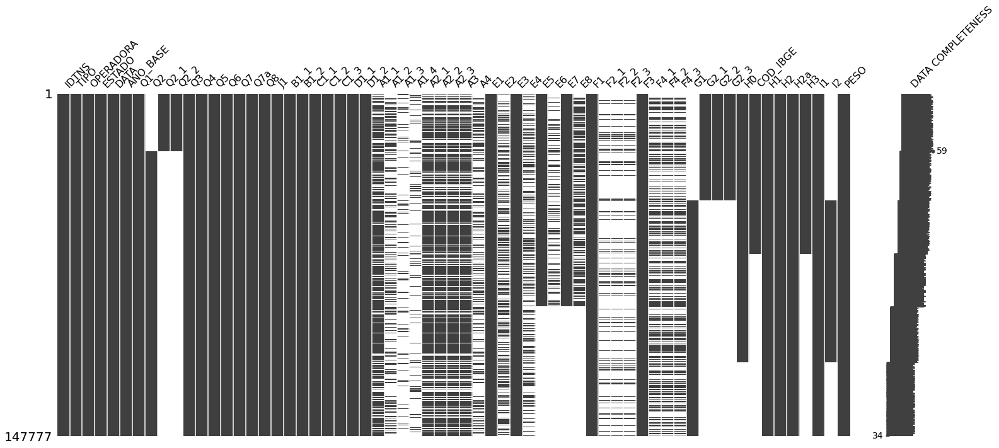
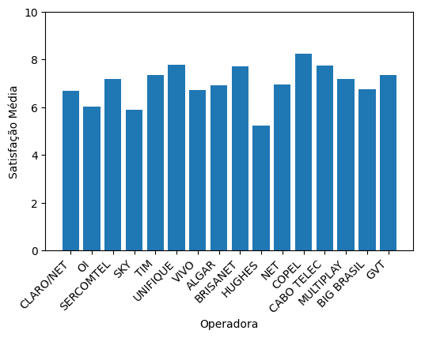
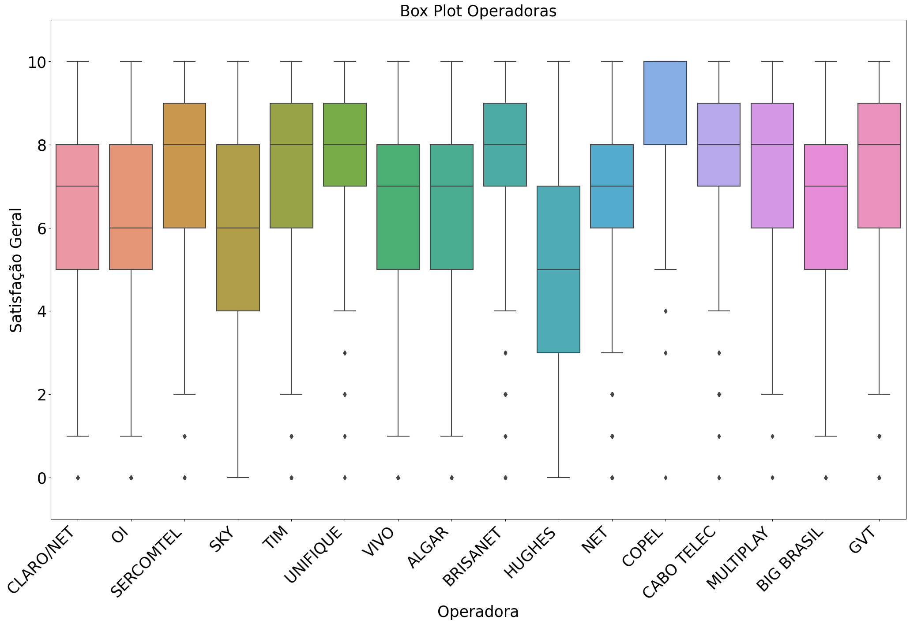
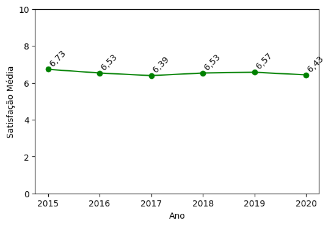
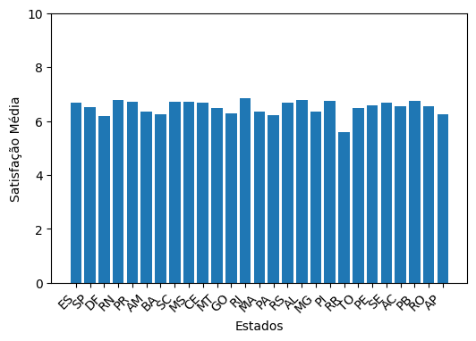

# machine-learning-anatel-database
Projeto inicial de dissertação do Mestrado em Engenharia de Produção na UEM. O propósito é explorar bases de dados da Anatel, para classificação conforme satisfação, operadora, e outros. 

# Visão Geral

- Problema: Classificar clientes de prestadoras de internet banda-larga conforme sua satisfação com o serviço, ou potencial cancelamento. 
- Base de Dados: A base consiste de uma pesquisa realizada de 2015 até 2020 com 147777 linhas e 63 colunas. 
- Estrutura dos Dados: A pesquisa consiste em pesquisas de Sim ou Não e Escala Likert de amplitura 10. 
-Células vazias: Como existem diversas condições e anos diferentes, a pesquisa apresenta algumas células vazias. Esse gráfico é fundamental para aplicar as técnicas de ML. 

# Análise Inicial

A pesquisa possui análise de 16 operadoras, e a satisfação média de cada uma varia. Observa-se que a Hughes possui valor menor, e Copel maior satisfação. 

A análise fica mais clara com o Box Plot de cada Operadora: 

Ao longo dos anos a satisfação média variou muito pouco:

Assim como pelos estados: 

Por fim, e uma análise prévia de correlação, observou-se que a satisfação com os valores cobrados pelo serviço possui uma correlação próxima de 0.5, o que não é forte, mas indica uma relação interessante.

